# 30200 Project Reproducibility Package

This folder contains the code, regenerated plots, report artifacts, and paper upload file for:

`A_Thorough_Analysis_of_Imbalances_in_Consolidated_Trades_Within_the_Bid_Ask_Spread (2).pdf`

Raw WRDS/TAQ CSV data are intentionally not included in this upload. They can be recreated with the retrieval scripts in `code/`.

## Folder Map

- `code/analysis.py`: original multi-quantile imbalance and microstructure analysis pipeline.
- `code/analysis2.py`: daily drift-screen, Brownian/log-return parameter, grouped future path, table, and image-export pipeline.
- `code/Data_retrieve.py`: WRDS TAQ trade retrieval and 1-minute OHLCV bar construction.
- `code/Data_retrieve_count.py`: WRDS TAQ trade/quote retrieval, quote-to-trade matching, midpoint volume classification, and 1-minute count aggregation.
- `reports/`: paper-relevant META PDF reports and derived CSV summaries produced by the analysis.
- `plot/`: regenerated PNG plots for paper insertion and README display.
- `paper_upload/`: uploaded paper PDF.

## Recreate The Raw Data

The analysis uses two WRDS-derived META datasets:

- 1-minute OHLCV bars from `Data_retrieve.py`
- 1-minute midpoint-classified trade volume from `Data_retrieve_count.py`

From `D:\30200_project\code`, set your WRDS credentials and run:

```powershell
cd D:\30200_project\code
$env:WRDS_USERNAME="your_wrds_username"
$env:WRDS_PASSWORD="your_wrds_password"

python Data_retrieve.py
python Data_retrieve_count.py
```

By default, the scripts retrieve the asset list and year range defined at the bottom of each file. To reproduce only the paper's META analysis, edit the `assets` list in both retrieval scripts to `["META"]` before running, or call `process_assets(...)` from Python with `assets=["META"]`.

Expected generated folders:

- `data_2016_2025\META\`
- `data_2016_2025_count\META\`

The Workflow2 analysis scripts used `data_2020_2025` and `data_2020_2025_count` paths. If you regenerate into `data_2016_2025`, either rename/copy those output folders to the expected names or pass the regenerated paths explicitly with `--main-base-dir` and `--count-base-dir`.

## Recreate The Analysis Results

After the data are retrieved, regenerate the PNG plots with:

```powershell
cd D:\30200_project\code
python analysis2.py --ticker META --images-only --image-dir D:\30200_project\plot --count-base-dir D:\30200_project\code\data_2016_2025_count --main-base-dir D:\30200_project\code\data_2016_2025
```

To regenerate the PDF report from `analysis2.py`:

```powershell
cd D:\30200_project\code
python analysis2.py --ticker META --output D:\30200_project\reports\meta_local_nojump_mle_report.pdf --count-base-dir D:\30200_project\code\data_2016_2025_count --main-base-dir D:\30200_project\code\data_2016_2025
```

The `plot/meta_microstructure_*.png` files are PNG exports of figures that were originally produced inside the microstructure PDF report from `analysis.py`.

## Plots

### Meta Daily Drifting Future Return Volatility
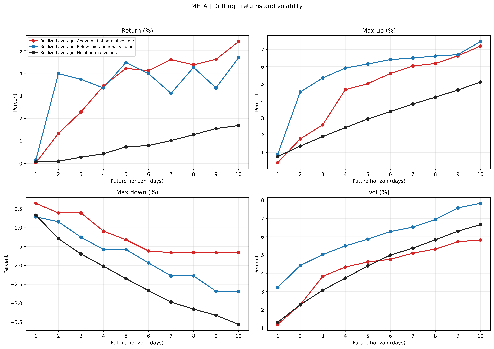

### Meta Daily Drifting Parameter Comparison
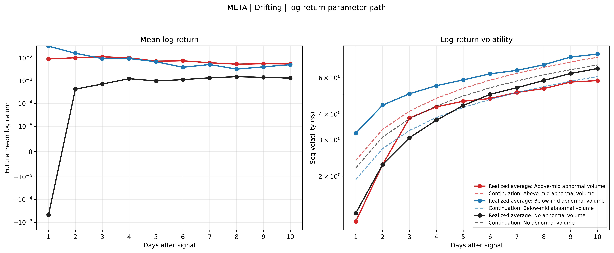

### Meta Daily Non Drifting Future Return Volatility
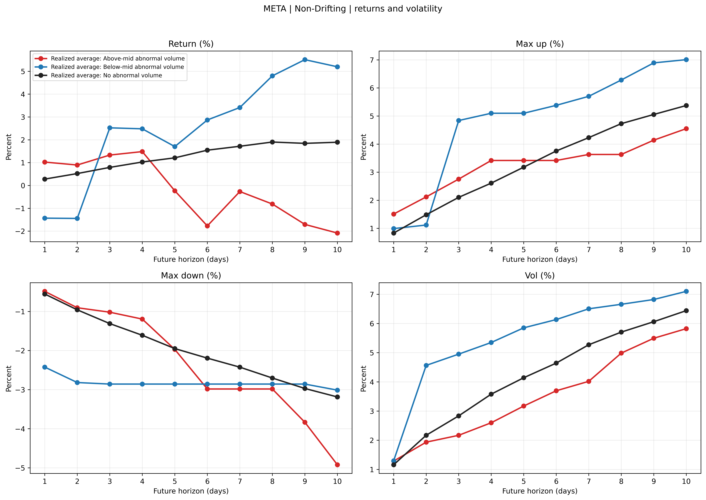

### Meta Daily Non Drifting Parameter Comparison
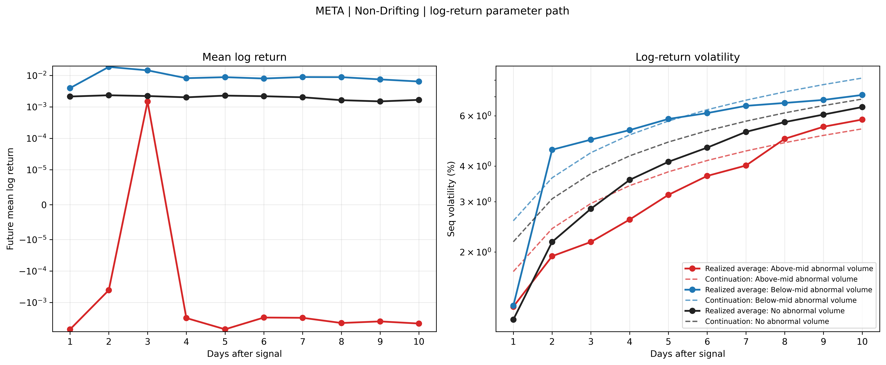

### Meta Daily Summary Stats Table Page 1
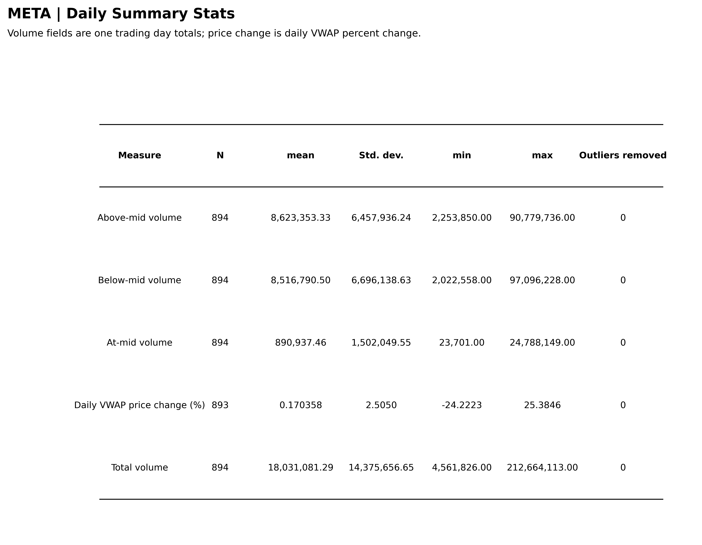

### Meta Diffusion Baseline Average Paths Drifting
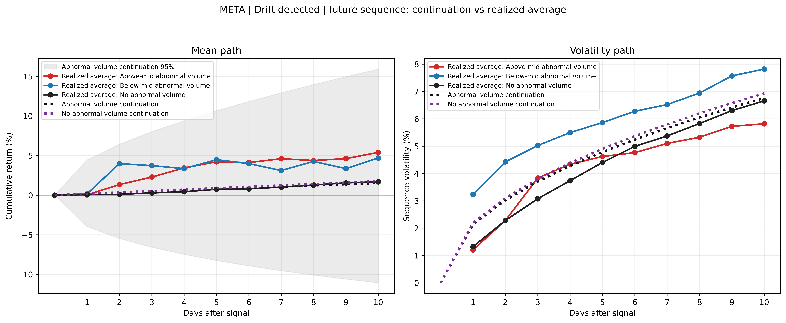

### Meta Diffusion Baseline Average Paths Non Drifting
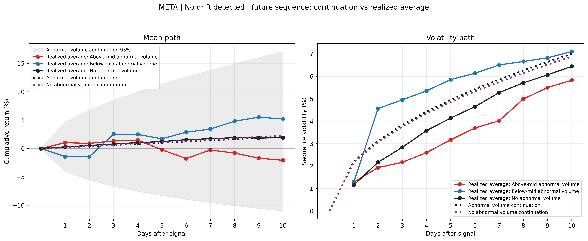

### Meta Example Path Daily 2025 12 30 15 59 00
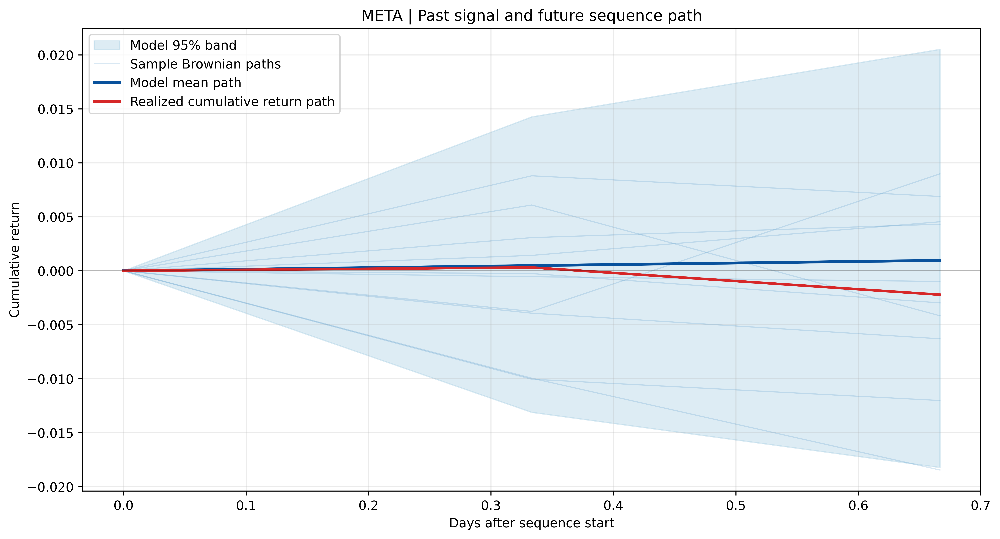

### Meta Microstructure Distribution Bid Ask Spread Log Scale
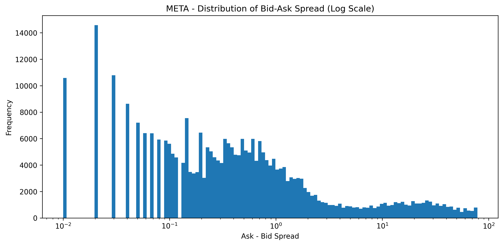

### Meta Microstructure Distribution Trade Volume Above Mid
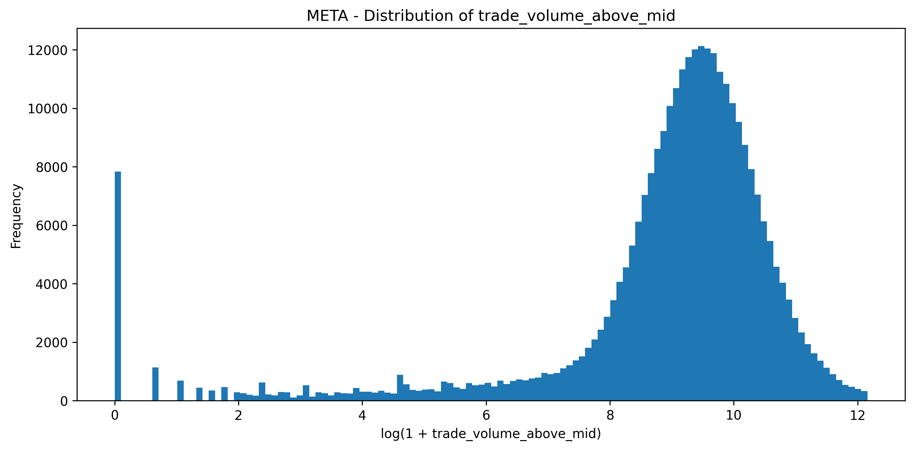

### Meta Microstructure Distribution Trade Volume At Mid
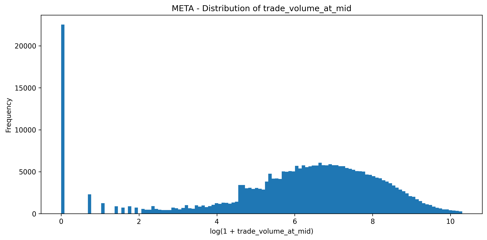

### Meta Microstructure Distribution Trade Volume Below Mid
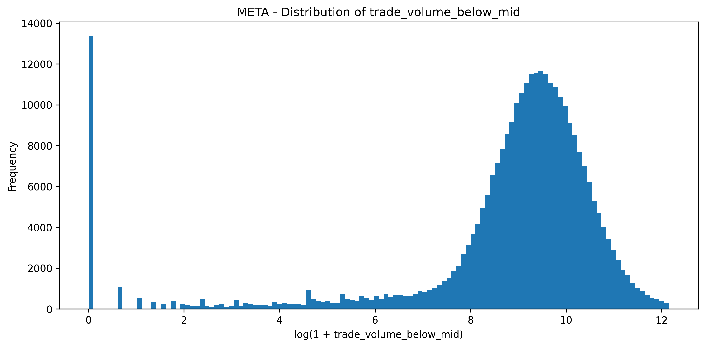

### Meta Microstructure Distribution Vwap Differences
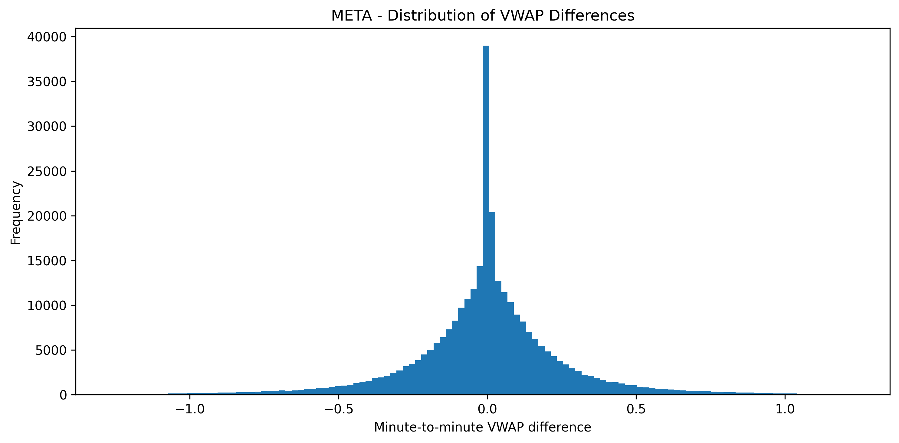

### Meta Microstructure Monthly Average Bid Ask Spread
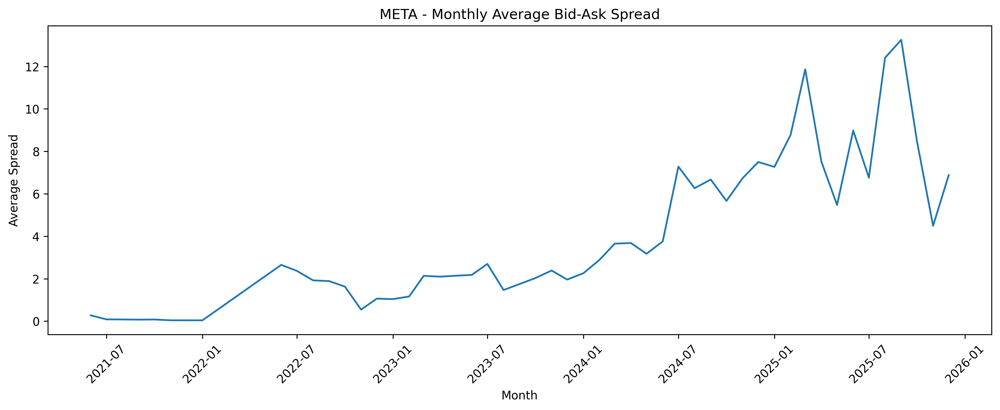

### Meta Q90 Abnormal Screen Frequency
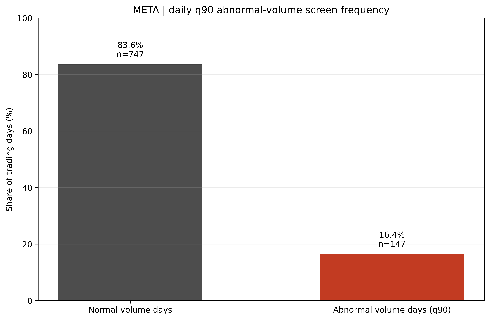

